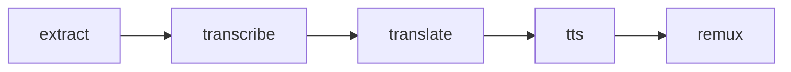

# Developer Guide

A level-by-level path from "running locally on one video" to "production cloud workflow on a batch". Each level adds one piece of complexity; you can stop at whichever level fits your need.

> **Read this top to bottom on your first run.** Sections 1–6 get you to a working local pipeline (no Docker, no cloud). Sections 7–9 add the cloud path. Reference content (architecture, manifest schema, env-var table, troubleshooting) is in the appendices.

## 1. Overview

| Level | What runs | Validates | Typical use |
|---|---|---|---|
| **L1** | `python -m pipeline run … --stage X` | A single stage in your Python process | Debug one step quickly; cheapest iteration |
| **L2** | `python -m pipeline run …` | Full 5-stage pipeline in-process | Default for local development |
| **L3** | `prepare-manifest` + `docker run` | One container image works same as in-process | Pre-cloud smoke; catch image bugs locally |
| **L4** | `scripts/probe_stage_remote.py <stage>` | One stage as a Nebius serverless job, no orchestrator | Test/debug each stage on a batch sample before plugging in an orchestrator |
| **L5** | `python -m hatchet.worker` + `python -m hatchet.trigger run …` | Full pipeline orchestrated by Hatchet (or another orchestrator) over Nebius | Production runs |

The same per-task `run_task(config)` function runs at every level — only the wrapper around it changes (in-process / Docker / serverless). **L4 is orchestrator-agnostic**: it launches Nebius jobs directly through the SDK; Hatchet at L5 is one of several orchestrators (Airflow, Prefect, a plain Python driver) that could take its place. See [Appendix A](#appendix-a--architecture) for the diagram.

## 2. Prerequisites

| Tool | When | Install |
|---|---|---|
| Python 3.11+ and [`uv`](https://docs.astral.sh/uv/) | L1+ | `curl -Lsf https://astral.sh/uv/install.sh \| sh` |
| Docker (with BuildKit) | L3+ | Docker Desktop |
| AWS CLI | L4+ | `pip install awscli` |
| Nebius account + bucket | L4+ | [console.nebius.ai](https://console.nebius.ai) |
| Hatchet account or self-hosted | L5 | [cloud.hatchet.run](https://cloud.hatchet.run), or `docker compose -f docker/docker-compose.yml up -d` then open `http://localhost:8888` (signup → create API token → paste into `.env` as `HATCHET_CLIENT_TOKEN`). If signup traps you on a "verify your email" page, flip the bit manually:<br>`docker compose -f docker/docker-compose.yml exec -T postgres psql -U hatchet -d hatchet -c 'UPDATE "User" SET "emailVerified" = true WHERE "emailVerified" = false;'` |

Sample videos already in the repo at [`data/sample_file/sample.mp4`](data/sample_file/sample.mp4) and [`data/sample_batch/`](data/sample_batch/). Need more? `python scripts/download_samples.py nasa --sample-size 10`.

## 3. One-time setup

```bash
uv sync
source .venv/bin/activate
uv pip install -e .

# .env (only needed once you reach Section 7 / L4)
cp .env.example .env
```

> `.env` is **credentials only** (Hatchet token, Nebius IAM, AWS keys). Functional config (image tag, model choice, batch size, target language) defaults live in [`src/pipeline/config.py`](src/pipeline/config.py) — edit the file for permanent changes, or set env vars inline on the command for one-off experiments. See [Appendix D](#appendix-d--configuration-reference).

---

## 4. Level 1 — One stage in Python

**Goal:** fastest possible feedback on a single stage. No Docker, no cloud.

```bash
# Extract audio from one video (~2 s on the sample)
python -m pipeline run sample_file/sample.mp4 --stage extract --run-id l1-demo

# Confirm output landed
ls data/runs/l1-demo/extract/                                 # expect sample.wav
jq '.status, .timing.wall_s' data/runs/l1-demo/reports/extract.json
# expect: "completed"  0.5-ish
```

Chain stages with the same `--run-id` — each downstream stage discovers its input via the upstream report:

```bash
python -m pipeline run sample_file/sample.mp4 --stage transcribe --run-id l1-demo --device cpu
python -m pipeline run sample_file/sample.mp4 --stage translate  --run-id l1-demo --device cpu
python -m pipeline run sample_file/sample.mp4 --stage tts        --run-id l1-demo --device cpu
python -m pipeline run sample_file/sample.mp4 --stage remux      --run-id l1-demo
```

Common flags:

| Flag | Default | Purpose |
|---|---|---|
| `--run-id` | `demo` | Output namespace under `data/runs/{run_id}/` |
| `--stage` | all 5 | Repeat for multiple in order (`--stage extract --stage transcribe`) |
| `--force` | off | Re-run even when outputs exist |
| `--device` | `cpu` | `cpu` or `cuda` (for transcribe/translate/tts) |
| `--lang` | `es` | NLLB translate target language code |

If something fails, see [Appendix E (L1/L2)](#appendix-e--troubleshooting).

---

## 5. Level 2 — Full pipeline in Python

**Goal:** validate the whole orchestrator + all 5 stages end-to-end on host.

```bash
# Single file (5–10 min on CPU)
python -m pipeline run sample_file/sample.mp4 --run-id l2-demo --device cpu

# Batch folder (all videos under data/sample_batch/)
python -m pipeline run sample_batch/ --run-id l2-batch --device cpu

# Verify the dubbed mp4
ls data/runs/l2-demo/remux/                            # expect sample.mp4
ffplay data/runs/l2-demo/remux/sample.mp4              # plays original video + Spanish audio
```

**Re-runs are safe.** Each stage skips files whose output already exists in `data/runs/{run_id}/`. To force re-process: add `--force` (whole pipeline) or delete that stage's output dir.

```bash
# Re-run only translate, ignoring the cached output
python -m pipeline run sample_file/sample.mp4 --run-id l2-demo --stage translate --force

# Full re-run from scratch
rm -rf data/runs/l2-demo && python -m pipeline run sample_file/sample.mp4 --run-id l2-demo
```

---

## 6. Level 3 — Single stage in Docker (local)

**Goal:** confirm a task's container image runs the same code as the in-process path. Catches Docker/dependency bugs before pushing to the cloud.

### Build images (once)

Pick a base matching your host: `base-cpu` for Mac/no-GPU, `base-cuda` for Linux+NVIDIA.

```bash
export DOCKER_BUILDKIT=1

# Build the shared base
docker build -f docker/base-cpu.Dockerfile -t video-dubbing-base:local .

# Build one task image on top of it
docker build -f docker/extract.Dockerfile -t video-dubbing-extract:local .
```

Repeat the second command for any other task you want to test (`transcribe`, `translate`, `tts`, `remux`).

### Run one stage in the container

```bash
RUN_ID=l3-demo

# Write the manifest (no execution — uses the same config as L1/L2)
python -m pipeline prepare-manifest extract --run-id "$RUN_ID" --source sample_file/sample.mp4

# Run the container against the local data dir
docker run --rm -v "$(pwd)/data:/data" video-dubbing-extract:local \
    /data/runs/$RUN_ID/manifests/extract.json

# Check the container's report
jq '.status' data/runs/$RUN_ID/reports/extract.json    # expect "completed"
```

Swap `extract` for any other stage — same `prepare-manifest` / `docker run` shape. For GPU stages add `--gpus all` to `docker run`.

Troubleshooting: see [Appendix E (L3)](#appendix-e--troubleshooting).

---

## 7. Cloud prep (before L4)

Three things must be in your bucket / registry before any Nebius job can succeed.

> **Load `.env` into your shell first.** Python code reads `.env` via pydantic-settings, but raw `aws` / `docker` commands don't. Once per shell session:
> ```bash
> set -a; source .env; set +a       # exports every KEY=VALUE from .env into the shell
> echo "$AWS_ENDPOINT_URL"          # confirm; should print https://storage.eu-north1.nebius.cloud
> ```

### A. Fill in `.env` credentials

```bash
# .env  —  fill in only these (everything else stays in config.py)
HATCHET_CLIENT_TOKEN=...
NEBIUS_IAM_TOKEN=...
NEBIUS_PROJECT_ID=...
NEBIUS_SUBNET_ID=...
NEBIUS_BUCKET_ID=...
NEBIUS_BUCKET_NAME=...
AWS_ACCESS_KEY_ID=...
AWS_SECRET_ACCESS_KEY=...
AWS_ENDPOINT_URL=https://storage.eu-north1.nebius.cloud
```

### B. Models in the bucket

HF auto-download is broken on FUSE — the container must find models already cached. One idempotent command does it all:

```bash
# Checks bucket → downloads any missing models locally → uploads to s3://<bucket>/models/
# Re-runs are no-ops once everything is in place.
python scripts/sync_models.py
```

### C. Sample video in the bucket

```bash
aws s3 cp data/sample_file/sample.mp4 \
  "s3://$NEBIUS_BUCKET_NAME/sample_file/sample.mp4" \
  --endpoint-url "$AWS_ENDPOINT_URL"
```

### D. Container images pushed

```bash
docker login                                             # once per session

# First build (or whenever pyproject.toml / docker/base-*.Dockerfile changes)
scripts/docker_build.sh --push

# Subsequent iterations (only src/jobs, src/pipeline, or task Dockerfiles changed)
scripts/docker_build.sh --skip-base --push
```

The script tags everything as `mnrozhkov/video-dubbing-<task>:v0.2.0` and re-pushes that tag in place. The `image_tag` default in [`src/pipeline/config.py`](src/pipeline/config.py) points at the same `v0.2.0`, so no env-var override is needed.

**Verify the images work before going to Nebius** — run the full DAG locally against your data, using the registry images and a bind-mounted `data/` directory:

```bash
# Pulls the just-pushed images and runs all 5 stages locally (--device cpu).
# Catches import errors, missing deps, broken COPY layers before burning cloud time.
scripts/docker_test.sh

# To reprocess from scratch on the same run-id:
scripts/docker_test.sh --force
```

See [scripts/docker_test.sh](scripts/docker_test.sh) for options (`--stage`, `--source`, `--run-id`, `--force`).

---

## 8. Level 4 — Run serverless jobs on Nebius (no orchestrator)

**Goal:** validate each pipeline stage as a standalone Nebius serverless job — single file or batch — **without** committing to any orchestrator yet. This is where you test/debug a container in the cloud before plugging in Hatchet (or Airflow, Prefect, a custom Python driver, etc. — see [Appendix A](#appendix-a--architecture)).

There are two equivalent ways to launch a stage's container on Nebius:

| Way | What runs | Best for |
|---|---|---|
| **A. Python probe** ([scripts/probe_stage_remote.py](scripts/probe_stage_remote.py)) | `~150 lines around pipeline.nebius.create_and_wait()` — writes manifest, launches the job, waits, records timeline + cost | Iterating on the pipeline locally; chaining all 5 stages by reusing `--run-id` |
| **B. Nebius CLI** (`nebius ai job create …`) | Direct shell command — same image, same JobSpec fields, no Python wrapper | Demonstrating that Nebius jobs are launchable from anywhere; smoke-test a single image without the repo |

Both produce identical effect: the same container runs against the same manifest. The probe just adds the manifest-write step + the timeline/cost report on top. Anything beyond a single stage (DAG, retries, concurrency) is an orchestrator's job and lives at L5+.

### Way A — Python probe

#### Test each stage in sequence (single file)

```bash
# Extract — defaults to sample_file/sample.mp4 in the bucket
python scripts/probe_stage_remote.py extract --run-id probe-single
# → prints the run_id; use it for the downstream chain.

# Downstream stages read their inputs from the upstream report — same --run-id
python scripts/probe_stage_remote.py transcribe --run-id probe-single
python scripts/probe_stage_remote.py translate  --run-id probe-single
python scripts/probe_stage_remote.py tts        --run-id probe-single
python scripts/probe_stage_remote.py remux      --run-id probe-single
```

#### Test each stage on a batch sample

Same script, point `--source` at a folder prefix instead of a file. All videos under the prefix get processed by the single Nebius job (no fan-out; that's an orchestrator concern):

```bash
# 1. Upload a batch sample to the bucket (one-time, after sample_batch/ exists in data/)
for f in data/sample_batch/*.mp4; do
  aws s3 cp "$f" "s3://$NEBIUS_BUCKET_NAME/sample_batch/$(basename "$f")" \
    --endpoint-url "$AWS_ENDPOINT_URL"
done

# 2. Probe extract on the whole prefix
python scripts/probe_stage_remote.py extract --source sample_batch/ --run-id probe-batch

# 3. Walk downstream stages — each picks up the upstream report
python scripts/probe_stage_remote.py transcribe --run-id probe-batch
python scripts/probe_stage_remote.py translate  --run-id probe-batch
python scripts/probe_stage_remote.py tts        --run-id probe-batch
python scripts/probe_stage_remote.py remux      --run-id probe-batch
```

The probe does a local pre-flight (every input present in bucket; upstream report exists for downstream stages) before spinning up the Nebius job — so misconfiguration fails in seconds rather than minutes.

Expected probe output for a successful run:

```
✓ SUCCESS

Total wall time:           87.4 s
Terminal state:            COMPLETED
Run time (RUNNING → term): 18.3 s

State-transition timeline:
  +  0.4s  QUEUED
  + 15.3s  STARTING
  + 60.7s  RUNNING        ← cold start
  + 79.0s  COMPLETED

job_id: computejob-e0…
```

The orchestration sidecar (timeline, cost estimate, savings vs on-demand) lands at `s3://<bucket>/runs/<run-id>/reports/<stage>__orch.json`. Inspect it with `aws s3 cp … - | jq .`.

### Way B — Nebius CLI (extract only, for demonstration)

To make the "no orchestrator" point concrete: here's the same extract launch done with the Nebius CLI directly. Two steps — write a manifest to the bucket, then launch the container against it — and you have a working serverless job without any Python wrapper code running on the host.

```bash
# 1. Write the manifest into the bucket — the container reads /data/runs/<id>/manifests/extract.json on startup
python -c "
from pipeline.run import PipelineRun
from pipeline.metadata import write_task_manifest
run = PipelineRun(video_keys=['sample_file/sample.mp4'], run_id='probe-cli', batch_id='probe', target_lang='es')
print('manifest at:', write_task_manifest(run, 'extract', executor='nebius'))
"

# 2. Confirm it landed in the bucket (NOT on your local fs)
aws s3 ls --endpoint-url "$AWS_ENDPOINT_URL" \
  "s3://$NEBIUS_BUCKET_NAME/runs/probe-cli/manifests/extract.json"

# 3. Launch the Nebius job — pure CLI, no SDK / no orchestrator
nebius ai job create \
    --name probe-cli-extract \
    --image mnrozhkov/video-dubbing-extract:v0.2.0 \
    --args /data/runs/probe-cli/manifests/extract.json \
    --volume "$NEBIUS_BUCKET_ID:/data" \
    --platform cpu-e2 \
    --preset 4vcpu-16gb \
    --disk-size 450Gi \
    --subnet-id "$NEBIUS_SUBNET_ID"

# 4. Watch progress (Nebius console, or CLI):
nebius ai job list --parent-id "$NEBIUS_PROJECT_ID"

# 5. Verify the output landed
aws s3 ls --endpoint-url "$AWS_ENDPOINT_URL" \
  "s3://$NEBIUS_BUCKET_NAME/runs/probe-cli/extract/"
# expect: sample.wav
```

Per-stage values (`--image`, `--platform`, `--preset`, `--disk-size`) come straight from [`src/pipeline/config.py`](src/pipeline/config.py). The Python probe at the top of this section reads those same fields and passes them to `JobServiceClient.create` — Way A and Way B differ in *who* sends the gRPC request, not *what* gets sent.

For the other four stages, the pattern is identical but `--platform` / `--preset` / `--disk-size` / `--image` change per stage (e.g. transcribe is `gpu-l40s-d` / `1gpu-16vcpu-96gb`). The Python probe handles this dispatch automatically; doing it by hand at the CLI gets tedious past one stage, which is exactly why an orchestrator (or even just the probe) earns its keep.

> **What L4 doesn't give you:** retries on preemption, parallelism across files, DAG-level skip-if-already-done. Those are L5 concerns. If a preempted job fails, you re-run by hand.

---

## 9. Level 5 — Orchestrate with Hatchet

**Goal:** production-style cloud run. The 5 stages are wired into a Hatchet workflow that handles retries on preemption, DAG dependencies, and orchestrator-level skip-if-outputs-exist. Hatchet is **one of several orchestrators** that could call the same Nebius jobs L4 just demonstrated — see [Appendix A](#appendix-a--architecture) for swap notes.

```bash
# Terminal 1 — keep the worker running
python -m hatchet.worker

# Terminal 2 — trigger
python -m hatchet.trigger run sample_file/sample.mp4 --run-id l5-demo
# or a batch (all videos under the prefix):
python -m hatchet.trigger run sample_batch/ --run-id l5-batch

# Retrieve the run summary (cost, savings, timing per stage)
aws s3 cp "s3://$NEBIUS_BUCKET_NAME/runs/l5-demo/run_summary.json" - \
  --endpoint-url "$AWS_ENDPOINT_URL" | jq .

# Retrieve the dubbed mp4
aws s3 cp "s3://$NEBIUS_BUCKET_NAME/runs/l5-demo/remux/sample.mp4" data/output.mp4 \
  --endpoint-url "$AWS_ENDPOINT_URL"
```

**Preemption recovery is automatic.** A failed Nebius job (preempt, error, timeout) raises `RuntimeError` → Hatchet retries the task (`config.stages.<stage>.retries`) → pre-flight on the retry sees the partial S3 state → only missing files re-run. **No orphaned cloud jobs on cancellation** — `create_and_wait` cancels the Nebius job on any abnormal exit. Details in [Appendix A](#appendix-a--architecture).

**Re-triggering the same `--run-id` is safe** — Hatchet pre-flight skips stages whose outputs already exist.

### Swapping the orchestrator

If you don't want Hatchet, write a ~50-line driver that calls [pipeline.nebius.create_and_wait()](src/pipeline/nebius.py) in dependency order (extract → transcribe → translate → tts → remux) — the same call the probe script makes. Apply your orchestrator's retry / DAG / scheduling semantics around it. The `run_task(config)` contract inside each container doesn't care which orchestrator scheduled it. The Hatchet wiring at [src/hatchet/workflow.py](src/hatchet/workflow.py) is the reference implementation.

---

## 10. Iterate after code changes

| Change | Image rebuild | Worker restart (L5) |
|---|---|---|
| `src/jobs/<task>.py` | `scripts/docker_build.sh --skip-base --push --task <task>` | required |
| `src/pipeline/*.py` (orchestrator-side) | — | required |
| `src/pipeline/config.py` (defaults) | — | required |
| `pyproject.toml` task group (e.g. `transcribe`) | rebuild that task image | required |
| `pyproject.toml` `cuda-base` / `cpu-base` | drop `--skip-base`, rebuild all 5 | required |
| `docker/<task>.Dockerfile` | rebuild that one image | required |
| `docker/base-*.Dockerfile` | drop `--skip-base`, rebuild all 5 | required |
| `.env` | never | required |

For **L1/L2**: no rebuild ever, no worker; just re-run the command. For **L3**: rebuild affected images only. For **L4**: rebuild + push, then re-run `probe_stage_remote.py` (no worker to restart). For **L5**: rebuild + push + restart Hatchet worker (caches config + image tag at startup).

---

# Appendices

## Appendix A — Architecture

Three layers — uniform across L1/L2/L3/L4/L5. The same `run_task(config)` function runs in every environment; only the wrapper differs.

```text
              ┌─────────────────────────────────────────┐
              │  pipeline/run.py  (in-process driver)   │   L1/L2
              └─────────────────────────────────────────┘
                              │
              writes manifest │ imports & calls
                              ▼
              ┌─────────────────────────────────────────┐
              │  jobs/<task>.py: run_task(config)       │   all levels
              │   • iterates files in-process           │
              │   • writes its own report               │
              └─────────────────────────────────────────┘
                              ▲
                  Docker      │   Serverless launcher = pipeline/nebius.py::create_and_wait
                  ENTRYPOINT  │     ↑
                  L3          │     │ called by L4 (probe_stage_remote.py)
                              │     │     and by L5 (hatchet/workflow.py)
                              │     │     — orchestrator-agnostic
              ┌─────────────────────────────────────────┐
              │   main() = load_manifest → run_task     │   L3/L4/L5 containers
              └─────────────────────────────────────────┘
```

**L4 vs L5: who launches the Nebius job.** At L4 the probe script calls `create_and_wait` directly — no DAG, no retries, no parallelism. At L5 Hatchet (or any other orchestrator) wraps the same call with retries / DAG dependencies / pre-flight skip-if-done. Swap Hatchet for Airflow / Prefect / a custom Python driver by writing ~50 lines that chain the five `create_and_wait` calls in dependency order; the per-stage container contract (`run_task(config: dict) -> dict`) is unchanged.

### Pipeline DAG



Each Hatchet task at L5 is **one** Nebius serverless job (no fan-out today; the `max_concurrent` knob in `config.stages.<stage>` is a forward-looking placeholder — see [.dev/spec.md](.dev/spec.md) Phase 4). Per-file idempotency inside `run_task` makes preempted-then-retried jobs cheap: only the files that didn't finish get reprocessed.

Hatchet preemption recovery: `create_and_wait` raises `RuntimeError` on Nebius `ERROR` state → Hatchet retries the task → pre-flight on retry sees the partial S3 state → fresh Nebius job processes only missing files. Cancellation cleanup: any abnormal exit from `create_and_wait` (Hatchet timeout, worker shutdown, our polling timeout) cancels the Nebius job via `JobServiceClient.cancel(...)` under `asyncio.shield` before re-raising. Nebius stops billing once the job reaches `CANCELLED`.

## Appendix B — Project layout

```text
src/
  pipeline/
    __main__.py           ← `python -m pipeline …` CLI (Typer)
    run.py                ← PipelineRun + run_stage / run_pipeline
    metadata.py           ← manifest read/write, stems discovery,
                            expected_output_keys, write_skipped_report,
                            make_timing, record_task_result, run summary
    nebius.py             ← create_and_wait() Nebius SDK helper
    paths.py              ← bucket-relative paths, resolve_video_keys, build_run_items
    storage.py            ← S3 + local fs I/O; use_local_artifacts contextvar; data_root()
    config.py             ← HatchetConfig (orchestrator + nested PipelineConfig); defaults in code
    cost.py               ← preset → $/min table, cost estimation
    batch.py              ← chunking helper for fan-out (forward-looking)
    utils.py              ← utc_now, Rich console + logging helpers
  jobs/
    extract.py            ← ffmpeg per file
    transcribe.py         ← faster-whisper + WhisperX
    translate.py          ← NLLB-200
    tts.py                ← Kokoro
    remux.py              ← ffmpeg per file
  hatchet/
    workflow.py           ← 6-task DAG (5 stages + summary); each stage: pre-flight → create_and_wait → verify
    worker.py             ← `python -m hatchet.worker`
    trigger.py            ← `python -m hatchet.trigger run …`
  models/                 ← model cache helpers + sync logic
docker/
  base-cpu.Dockerfile     ← shared CPU + torch (Mac / no-GPU)
  base-cuda.Dockerfile    ← shared CUDA + torch (Nebius / Linux+GPU)
  <task>.Dockerfile       ← one per task; FROM video-dubbing-base
  docker-compose.yml      ← self-hosted Hatchet (optional)
scripts/
  download_samples.py
  sync_models.py          ← one-shot: check bucket → download missing → upload → verify
  probe_stage_remote.py   ← L4: one Nebius job at a time, no orchestrator
  docker_build.sh
  uv_sync_task.sh
data/                     ← local input/output (git-ignored)
```

**Per-task interface** — uniform across all 5 jobs:

```python
def run_task(config: dict) -> dict:   # processes all files for this run; writes report
def main() -> None:                   # load_manifest → run_task; argv entry for Docker/Nebius
```

Naming: on disk it's a **manifest** JSON (`runs/{run_id}/manifests/<task>.json`); in Python the parameter is named `config` because that's what the task receives.

## Appendix C — Manifest / report shape

### Task manifest — `runs/{run_id}/manifests/<task>.json`

```json
{
  "task": "transcribe",
  "run_id": "demo",
  "batch_id": "local",
  "input_count": 12,
  "target_lang": "es",
  "force": false,
  "created_at": "2026-05-21T12:00:00+00:00",
  "executor": "python | docker | nebius",
  "video_keys": null,
  "config": {
    "image_name": "mnrozhkov/video-dubbing-transcribe",
    "model": "distil-large-v3",
    "device": "cuda",
    "align_lang": "en",
    "batch_size": 10,
    "compute": {
      "platform": "gpu-l40s-d",
      "preset": "1gpu-16vcpu-96gb",
      "preemptible": true,
      "job_disk_gb": 450,
      "job_timeout_min": 90
    }
  }
}
```

- `video_keys` is populated **only for extract** (so the standalone container knows what to process). Downstream stages derive inputs from the upstream report.
- `batch_size` is a forward-looking knob; today no runtime code reads it. It changes the manifest fingerprint and therefore the cache key.
- Orchestration knobs (`max_concurrent`, `retries`) are **not** in the per-stage manifest — they're Hatchet-side, kept on `config.stages.<stage>` and consumed at workflow registration.

Container argv: `/data/runs/{run_id}/manifests/<task>.json` (one string).

### Task report — `runs/{run_id}/reports/<task>.json`

```json
{
  "task": "transcribe",
  "run_id": "demo",
  "status": "completed",
  "device": "cuda",
  "started_at": "2026-05-21T12:00:00+00:00",
  "completed_at": "2026-05-21T12:05:12+00:00",
  "manifest_key": "runs/demo/manifests/transcribe.json",
  "wall_s": 312.5,
  "timing": {
    "task": "transcribe",
    "total_files": 12,
    "processed_files": 12,
    "skipped_files": 0,
    "wall_s": 312.5,
    "per_file_s": 26.0
  },
  "outputs": { "transcript_keys": [...], "aligned_keys": [...] },
  "error": null
}
```

Status is `completed`, `skipped` (pre-flight found all outputs), or `failed`.

### Output layout

```text
data/runs/{run_id}/manifests/{task}.json   ← config snapshot, written before each stage
data/runs/{run_id}/reports/{task}.json     ← result + timing, written after each stage
data/runs/{run_id}/extract/{stem}.wav
data/runs/{run_id}/transcribe/{stem}.txt
data/runs/{run_id}/transcribe/{stem}_aligned.json
data/runs/{run_id}/translate/{stem}.txt
data/runs/{run_id}/tts/{stem}.wav
data/runs/{run_id}/remux/{stem}.mp4
```

Cloud runs (L4 and L5) also write `reports/<task>__orch.json` (Nebius timeline + cost). L5 additionally writes `run_summary.json` (workflow-level aggregate produced by the final Hatchet `summary` task).

## Appendix D — Configuration reference

Configuration lives in [`src/pipeline/config.py`](src/pipeline/config.py) as two pydantic-settings objects:

- **`config`** (`HatchetConfig`) — top-level. Hatchet orchestrator knobs at the root, per-stage Hatchet orchestration under `config.stages.<stage>`, the pipeline definition under `config.pipeline`. Access: `config.pipeline.transcribe.model`, `config.stages.transcribe.retries`, etc.
- **`secrets`** (`Secrets`) — cloud credentials loaded from `.env`; never committed.

Both load lazily, so L1/L2/L3 work without Nebius/Hatchet credentials.

### Overriding fields

The env-var tree has three prefixes:

- **`PIPELINE__…`** — what the pipeline does (target language, image tag, per-stage model/device/compute)
- **`STAGES__…`** — Hatchet orchestration per stage (`max_concurrent`, `retries`)
- **(unprefixed)** — workflow-wide Hatchet knobs (`WORKFLOW_NAME`, `TIMEOUT_BUFFER_S`)

`<stage>` is one of `extract`, `transcribe`, `translate`, `tts`, `remux`.

| Knob | Override | What it controls |
|---|---|---|
| `pipeline.target_lang` | `PIPELINE__TARGET_LANG=de` or `--lang de` | NLLB translate target |
| `pipeline.image_tag` | `PIPELINE__IMAGE_TAG=v0.3.0` | Tag applied to every stage image |
| `pipeline.<stage>.image_name` | `PIPELINE__TRANSCRIBE__IMAGE_NAME=…` | Per-stage registry/repo override |
| `pipeline.<stage>.compute.platform` | `PIPELINE__TRANSCRIBE__COMPUTE__PLATFORM=gpu-h200-sxm` | Nebius GPU/CPU type |
| `pipeline.<stage>.compute.preset` | `PIPELINE__TRANSCRIBE__COMPUTE__PRESET=1gpu-16vcpu-200gb` | VM size |
| `pipeline.<stage>.compute.preemptible` | `PIPELINE__TRANSCRIBE__COMPUTE__PREEMPTIBLE=true` | Spot vs on-demand |
| `pipeline.<stage>.compute.job_timeout_min` | `PIPELINE__TRANSCRIBE__COMPUTE__JOB_TIMEOUT_MIN=120` | Source of truth for stage timeout. Hatchet's `execution_timeout` is derived as `job_timeout_min × 60 + timeout_buffer_s`. |
| `pipeline.<stage>.compute.job_disk_gb` | `PIPELINE__TRANSCRIBE__COMPUTE__JOB_DISK_GB=500` | Network SSD on the Nebius job |
| `pipeline.<stage>.model` | `PIPELINE__TRANSCRIBE__MODEL=large-v3` | Model selection (Whisper / NLLB / Kokoro) |
| `pipeline.<stage>.device` | `PIPELINE__TRANSCRIBE__DEVICE=cuda` or `--device cpu` | Torch device |
| `pipeline.<stage>.batch_size` | `PIPELINE__TRANSCRIBE__BATCH_SIZE=32` | Forward-looking (Phase 4) |
| `pipeline.tts.voice / lang / repo` | `PIPELINE__TTS__VOICE=af_heart`, `PIPELINE__TTS__LANG=a`, `PIPELINE__TTS__REPO=…` | Kokoro voice / language |
| `stages.<stage>.max_concurrent` | `STAGES__TRANSCRIBE__MAX_CONCURRENT=4` | Parallel Nebius jobs cap (Phase 4) |
| `stages.<stage>.retries` | `STAGES__TRANSCRIBE__RETRIES=5` | Hatchet retries for this stage |
| `workflow_name` | `WORKFLOW_NAME=…` | Hatchet workflow name (dashboard label) |
| `timeout_buffer_s` | `TIMEOUT_BUFFER_S=900` | Cold start + SDK overhead, added to `job_timeout_min` |

### Experiment matrix

For sweeps like "L40S vs H100 × batch_size 4/8/16/32 × preemptible on/off":

1. One shell script (or `direnv`) per matrix row that exports the right env vars + triggers.
2. Each run's `runs/<id>/manifests/<task>.json` is the **full reproducible config snapshot** — perfect for after-the-fact cost/time analysis.
3. Compare `timing.wall_s`, `per_file_s`, and the `__orch.json` cost figures across reports.

## Appendix E — Troubleshooting

### L1 / L2 — Python in-process

| Symptom | Fix |
|---|---|
| `Got unexpected extra argument (run)` | Use `python -m pipeline run …` |
| `Video file not found` / `No video files under …` | Path is bucket-relative under `data/`; use `sample_file/sample.mp4` or `sample_batch/` |
| `FileNotFoundError: manifest not found` | Run upstream stage first, or run the full pipeline without `--stage` |
| Transcribe very slow | Expected on CPU. Default `--device cpu` is ~10× slower than GPU |
| Out of memory (translate) | Smaller model: `PIPELINE__TRANSLATE__MODEL=facebook/nllb-200-distilled-600M` |
| `ModuleNotFoundError: pipeline / jobs` | `uv pip install -e .` |
| `ModuleNotFoundError: faster_whisper / kokoro` | `uv sync --group transcribe` (or `tts`, `translate`) |

### L3 — Docker manual

| Symptom | Fix |
|---|---|
| `failed to resolve BASE_IMAGE` | Build the base first: `docker build -f docker/base-cpu.Dockerfile -t video-dubbing-base:local .` |
| `libcudart.so … cannot open shared object file` | Built with CUDA base on a CPU host. Rebuild with `base-cpu.Dockerfile`, then task images |
| `manifest not found` | Run `python -m pipeline prepare-manifest <stage> --run-id <id>` before `docker run` |
| ffmpeg fails inside container | Confirm `-v $(pwd)/data:/data` is on the `docker run` |
| Build fails on Apple Silicon | Use `docker/base-cpu.Dockerfile` for local; only use `base-cuda` + `--platform linux/amd64` for cloud |

### L4 — Cloud (Hatchet + Nebius)

| Symptom | Fix |
|---|---|
| Worker exits immediately | Check `HATCHET_CLIENT_TOKEN` is valid |
| `Request error UNAUTHENTICATED` from Nebius SDK | Nebius IAM token expired — refresh and update `.env` |
| Job stuck in `PENDING` | Check Nebius quota; verify `NEBIUS_PROJECT_ID` and `NEBIUS_SUBNET_ID` |
| `AMD64 required` | Use `scripts/docker_build.sh` (defaults to `--platform linux/amd64`) |
| Task retries with "preempted" RuntimeError | Expected on `preemptible=true` GPUs. Hatchet retries; per-file outputs survive in S3 |
| Pre-flight reports `all outputs present; skipping Nebius launch` | Intentional — outputs already exist. `--force` to override |
| Container fails with `No such file or directory: /data/<key>` | Input video or model cache missing in the bucket. Run `scripts/sync_models.py` + `aws s3 cp` the sample |
| Container fails on `import whisperx` with `libcudart.so.13` | torchaudio CUDA-version drift. Rebuild after pulling latest (fix in `scripts/uv_sync_task.sh`) |
| Container panics in `hf_xet` on FUSE | Pre-existing fix; if you see it, confirm the worker is using the latest images (`scripts/docker_build.sh --skip-base --push` + restart worker) |
| Output file missing after task `COMPLETED` | Verify in S3 with `aws s3 ls`; check `NEBIUS_BUCKET_NAME` and `AWS_*` creds |

Deeper write-up of the L4-only failure modes (and their fixes) lives in [`.dev/talk.md`](.dev/talk.md).
