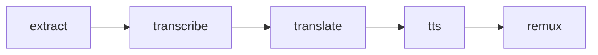

# Developer Guide

Four progressive levels of running the pipeline — same per-task code path at every level. Pick the lowest level that fits your need.

| Level                                 | What runs                                                                       | When to use                                          |
| ------------------------------------- | ------------------------------------------------------------------------------- | ---------------------------------------------------- |
| **L1 — Python, one stage**            | `python -m pipeline run … --stage <S>` in-process                                | Debug one step on host Python; no Docker             |
| **L2 — Python, end-to-end**           | `python -m pipeline run …` (all stages)                                          | Full pipeline locally with no Docker                 |
| **L3 — Docker, manual**               | `prepare-manifest` + `docker run` per stage, by hand                             | Smoke-test container images before cloud             |
| **L4 — Hatchet → Nebius**             | `python -m hatchet.trigger run …` (cloud workflow)                               | Cloud-scale runs and experiments                     |

**Start with L1 / L2** — same stage code, same `runs/{run_id}/` output layout, no cloud credentials needed.

---

## Architecture

Three layers. No executor abstraction; no fan-out.

```text
              ┌─────────────────────────────────────────┐
              │  pipeline/run.py  (orchestrator, sync)  │
              └─────────────────────────────────────────┘
                              │
              writes manifest │ imports & calls
                              ▼
              ┌─────────────────────────────────────────┐
              │  jobs/<task>.py: run_task(config)       │
              │   • iterates files in-process           │
              │   • writes its own report               │
              └─────────────────────────────────────────┘
                              ▲
                  Docker      │      Nebius (via hatchet/workflow.py
                  ENTRYPOINT  │       → pipeline/nebius.py::create_and_wait)
                              │
              ┌─────────────────────────────────────────┐
              │   main() = load_manifest → run_task     │
              └─────────────────────────────────────────┘
```

- **`pipeline/`** — orchestrator + manifest/report I/O + storage abstraction
- **`jobs/`** — uniform `run_task(config: dict) -> dict` per stage; same function called by Python, Docker, and Nebius
- **`hatchet/`** — Hatchet workflow + worker/trigger CLI

One Nebius job per Hatchet task (no fan-out). Idempotency is per-file inside `run_task` (skip when the output already exists). Hatchet retries on `RuntimeError` from `create_and_wait`, which is how preemption recovery works.

---

## Project layout

```text
src/
  pipeline/
    __main__.py           ← `python -m pipeline …` CLI (Typer)
    run.py                ← PipelineRun + run_stage / run_pipeline
    metadata.py           ← TaskManifest, write/read manifest+report,
                            expected_output_keys, write_skipped_report,
                            make_timing, record_task_result
    nebius.py             ← create_and_wait() Nebius SDK helper
    paths.py              ← bucket-relative paths, resolve_video_keys, build_run_item(s)
    storage.py            ← S3 + local fs I/O; use_local_artifacts contextvar; data_root()
    config.py             ← nested per-task Settings (defaults in code)
    utils.py              ← utc_now, Rich console + logging helpers
  jobs/
    extract.py            ← ffmpeg per file
    transcribe.py         ← faster-whisper + WhisperX
    translate.py          ← NLLB-200
    tts.py                ← Kokoro
    remux.py              ← ffmpeg per file
  hatchet/
    workflow.py           ← 5-task DAG; each task: pre-flight → create_and_wait → verify
    worker.py             ← `python -m hatchet.worker`
    trigger.py            ← `python -m hatchet.trigger run …`
    download.py           ← sample download commands
  models/                 ← model cache helpers, pre-download CLI
docker/
  base-cpu.Dockerfile     ← shared CPU + torch (Mac / no-GPU)
  base-cuda.Dockerfile    ← shared CUDA + torch (Nebius / Linux+GPU)
  extract.Dockerfile      ← ffmpeg + CPU base
  transcribe.Dockerfile
  translate.Dockerfile
  tts.Dockerfile
  remux.Dockerfile        ← ffmpeg + CPU base
  docker-compose.yml      ← self-hosted Hatchet (optional)
scripts/
  download_samples.py
  download_models.py
  uv_sync_task.sh         ← installs one task group on top of base image
data/                     ← local input/output (git-ignored)
```

**Per-task interface** — uniform across all 5 jobs:

```python
# jobs/<task>.py
def run_task(config: dict) -> dict:
    """Process all files, iterate in-process, write report, return payload."""

def main() -> None:
    """argv entry for Docker/Nebius: load manifest → run_task(config)."""
    config = load_manifest(manifest_path_from_argv())
    run_task(config)
```

Naming: on disk it's a **manifest** JSON (`runs/{run_id}/manifests/<task>.json`); in Python the parameter is named **`config`** because that's what the task receives to do its work.

---

## CLI (Typer + Rich)

After `uv pip install -e .`:

| Task                           | Command                                                                              |
| ------------------------------ | ------------------------------------------------------------------------------------ |
| **L1 — single stage (Python)** | `python -m pipeline run sample.mp4 --stage transcribe --run-id demo`                 |
| **L2 — full pipeline (Python)**| `python -m pipeline run sample.mp4 --run-id demo`                                    |
| **L2 — batch folder**          | `python -m pipeline run sample_batch/ --run-id batch-001`                            |
| **L3 — prepare a manifest**    | `python -m pipeline prepare-manifest transcribe --run-id demo`                       |
| Download samples               | `python scripts/download_samples.py nasa --sample-size 10`                           |
| Download models                | `python scripts/download_models.py all`                                              |
| Model cache status             | `python scripts/download_models.py status`                                           |
| **L4 — cloud trigger**         | `python -m hatchet.trigger run sample.mp4 --run-id demo`                             |
| L4 — cloud trigger (prefix)    | `python -m hatchet.trigger run sample_batch/ --run-id demo`                          |
| L4 — start worker              | `python -m hatchet.worker`                                                           |

---

## L1 / L2 — Python in-process

No Docker. No cloud creds. Each `run_task` runs in your Python process; jobs read/write under `./data` (the host) via the `use_local_artifacts` contextvar; `data_root()` resolves to your data dir, not `/data`.

### Setup

```bash
uv sync
source .venv/bin/activate
uv pip install -e .

# Model cache (one-time): pre-download weights to data/models/
python scripts/download_models.py all
python scripts/download_models.py status     # cache table without downloading
```

### Run

```bash
# L1 — single stage
python -m pipeline run sample_file/sample.mp4 --stage extract    --run-id l1-single
python -m pipeline run sample_file/sample.mp4 --stage transcribe --run-id l1-single
python -m pipeline run sample_file/sample.mp4 --stage translate  --run-id l1-single
python -m pipeline run sample_file/sample.mp4 --stage tts        --run-id l1-single
python -m pipeline run sample_file/sample.mp4 --stage remux      --run-id l1-single

# L2 — full pipeline, single file
python -m pipeline run sample_file/sample.mp4 --run-id l2-single

# L2 — full pipeline, batch folder
python -m pipeline run sample_batch/ --run-id l2-batch

# Multiple specific stages in order
python -m pipeline run sample_file/sample.mp4 --run-id demo --stage extract --stage transcribe

# Override target language
python -m pipeline run sample_file/sample.mp4 --run-id demo --lang de
```

### CLI options

| Flag         | Default                | Purpose                                              |
| ------------ | ---------------------- | ---------------------------------------------------- |
| `--run-id`   | `demo`                 | Output namespace under `runs/{run_id}/`              |
| `--stage`    | all 5 stages           | Repeat for multiple stages in order                  |
| `--force`    | off                    | Reprocess every file (don't skip existing outputs)   |
| `--device`   | `cpu`                  | Override device for transcribe/translate/tts         |
| `--lang`     | `config.pipeline.target_lang` | NLLB translate target                         |
| `--batch-id` | `local`                | Label stored on the manifest (cosmetic locally)      |
| `--data-dir` | `<repo>/data`          | Host directory used as the artifact root             |

### Output layout

```text
data/runs/{run_id}/manifests/{task}.json   ← config snapshot, written before each stage
data/runs/{run_id}/reports/{task}.json     ← result + timing, written after each stage
data/runs/{run_id}/extract/{stem}.wav
data/runs/{run_id}/transcribe/{stem}.txt
data/runs/{run_id}/transcribe/{stem}_aligned.json
data/runs/{run_id}/translate/{stem}.txt
data/runs/{run_id}/tts/{stem}.wav
data/runs/{run_id}/remux/{stem}.mp4
```

Input videos stay at their original keys (e.g. `data/sample_file/sample.mp4`).

### Skip / re-run

Each `run_task` skips files whose output artifacts already exist (unless `--force`). Re-running the same `--run-id` is safe; downstream stages discover their input file list from the upstream report.

```bash
# Re-run only the translate stage (existing earlier outputs reused)
python -m pipeline run sample_file/sample.mp4 --run-id l2-single --stage translate --force

# Full re-run from scratch — delete outputs first
rm -rf data/runs/l2-single
python -m pipeline run sample_file/sample.mp4 --run-id l2-single
```

---

## L3 — Docker manual (one container per stage)

Use this to validate container images locally before pushing them to Nebius. You prepare each stage's manifest yourself, then run one `docker run` per stage.

### 1. Build the local images

```bash
export DOCKER_BUILDKIT=1
```

| Host                       | Base Dockerfile               |
| -------------------------- | ----------------------------- |
| Mac / no NVIDIA GPU        | `docker/base-cpu.Dockerfile`  |
| Linux + NVIDIA GPU         | `docker/base-cuda.Dockerfile` |

**Step A — shared base** (build once):

```bash
# Mac / CPU
docker build -f docker/base-cpu.Dockerfile -t video-dubbing-base:local .

# Linux + NVIDIA (optional local GPU)
docker build -f docker/base-cuda.Dockerfile -t video-dubbing-base:local .
```

**Step B — task images** (incremental on the base):

```bash
docker build -f docker/extract.Dockerfile    -t video-dubbing-extract:local    .
docker build -f docker/transcribe.Dockerfile -t video-dubbing-transcribe:local .
docker build -f docker/translate.Dockerfile  -t video-dubbing-translate:local  .
docker build -f docker/tts.Dockerfile        -t video-dubbing-tts:local        .
docker build -f docker/remux.Dockerfile      -t video-dubbing-remux:local      .
```

Each task image's `ENTRYPOINT` is `["python3", "-m", "jobs.<task>"]`. The single argv is the manifest path inside the container.

### 2. Run the pipeline one stage at a time

`prepare-manifest` writes `data/runs/<id>/manifests/<stage>.json` from the same configuration the orchestrator would use, **without** running the stage. The container then reads that file and processes its inputs.

```bash
DATA="$(pwd)/data"
RUN_ID=l3-demo

# Stage 1 — extract (single file)
python -m pipeline prepare-manifest extract --run-id "$RUN_ID" --source sample_file/sample.mp4
docker run --rm -v "$DATA:/data" video-dubbing-extract:local \
    /data/runs/$RUN_ID/manifests/extract.json

# Stage 2 — transcribe (CPU; pass --gpus all for GPU)
python -m pipeline prepare-manifest transcribe --run-id "$RUN_ID" --device cpu
docker run --rm -v "$DATA:/data" video-dubbing-transcribe:local \
    /data/runs/$RUN_ID/manifests/transcribe.json

# Stage 3 — translate
python -m pipeline prepare-manifest translate --run-id "$RUN_ID" --device cpu
docker run --rm -v "$DATA:/data" video-dubbing-translate:local \
    /data/runs/$RUN_ID/manifests/translate.json

# Stage 4 — tts
python -m pipeline prepare-manifest tts --run-id "$RUN_ID" --device cpu
docker run --rm -v "$DATA:/data" video-dubbing-tts:local \
    /data/runs/$RUN_ID/manifests/tts.json

# Stage 5 — remux
python -m pipeline prepare-manifest remux --run-id "$RUN_ID"
docker run --rm -v "$DATA:/data" video-dubbing-remux:local \
    /data/runs/$RUN_ID/manifests/remux.json

# Batch variant — same commands, replace --source with the folder prefix
python -m pipeline prepare-manifest extract --run-id "$RUN_ID-batch" --source sample_batch/
docker run --rm -v "$DATA:/data" video-dubbing-extract:local \
    /data/runs/$RUN_ID-batch/manifests/extract.json
# … etc
```

For GPU containers add `--gpus all`:

```bash
docker run --rm -v "$DATA:/data" --gpus all video-dubbing-transcribe:local \
    /data/runs/$RUN_ID/manifests/transcribe.json
```

The job inside the container writes the report (`runs/$RUN_ID/reports/<stage>.json`) when it finishes, exactly like in Python mode.

---

## L4 — Hatchet + Nebius (cloud)

One Hatchet task per pipeline stage. Each task:

1. **Pre-flight**: scans S3 for expected outputs (derived from upstream report or `run.video_keys`).
   - If everything is already there and `force=False`, writes a `status: "skipped"` report and returns — **no Nebius launch**.
2. **Otherwise**: writes the task manifest, calls `create_and_wait()` → one Nebius serverless job runs the container against the manifest.
   - Inside the container, `run_task` skips per-file when output already exists (idempotent on retries).
3. **Post-flight**: re-scans S3; raises if any expected output is still missing.

**Preemption recovery is automatic.** `create_and_wait` raises `RuntimeError` on Nebius `ERROR` state → Hatchet retries the task (`config.stages.<stage>.retries`) → pre-flight on the retry sees the partial S3 state → launches a fresh Nebius job that processes only the missing files.

**No orphaned cloud jobs on Hatchet timeout.** If the Hatchet task's `execution_timeout` fires (or the worker shuts down, or any other cancellation reaches the awaiting coroutine), `create_and_wait` catches the cancellation, calls `JobServiceClient.cancel(...)` on the Nebius job, polls until it reaches a terminal state (typically `CANCELLED`), and only then re-raises. The cleanup runs inside `asyncio.shield` so it completes even while the outer task is being cancelled. Nebius compute stops billing once the job is `CANCELLED`.

### Workflow definition

```python
# src/hatchet/workflow.py
@workflow.task(execution_timeout=_hatchet_timeout(config.pipeline.transcribe), retries=config.stages.transcribe.retries)
async def transcribe(run: PipelineRun, ctx: Context) -> dict:
    return await _run_remote("transcribe", run, ctx)
```

`_run_remote(task, run, ctx)` implements the 3-step flow above.

### Prerequisites

| Tool       | Install                                                                  |
| ---------- | ------------------------------------------------------------------------ |
| `uv`       | `curl -Lsf https://astral.sh/uv/install.sh \| sh`                        |
| Nebius CLI | https://docs.nebius.com/cli                                              |
| AWS CLI    | `pip install awscli` (for S3 operations against the Nebius bucket)       |

### Step 1 — Nebius project setup

1. Create a project at [console.nebius.ai](https://console.nebius.ai)
2. Note your **Project ID** and **Subnet ID** (Networking → Subnets)
3. Create an **IAM service account** and generate a key (IAM → Service accounts)
4. Create an **Object Storage bucket** and generate **access keys** (Storage → Buckets)

### Step 2 — Hatchet setup

Option A — Cloud (recommended for first run):

1. Sign up at [cloud.hatchet.run](https://cloud.hatchet.run)
2. Create a tenant → Settings → API Keys → generate token

Option B — Self-hosted:

```bash
docker compose -f docker/docker-compose.yml up -d
# Open http://localhost:8080 → create a token
```

### Step 3 — Configure `.env`

```bash
cp .env.example .env
```

Fill in **credentials only**:

```bash
HATCHET_CLIENT_TOKEN=...
NEBIUS_IAM_TOKEN=...
NEBIUS_PROJECT_ID=...
NEBIUS_SUBNET_ID=...
NEBIUS_BUCKET_ID=...
NEBIUS_BUCKET_NAME=...
AWS_ACCESS_KEY_ID=...
AWS_SECRET_ACCESS_KEY=...
AWS_ENDPOINT_URL=https://storage.eu-north1.nebius.cloud
```

All tunables (image URIs, models, batch sizes, timeouts) default in `src/pipeline/config.py`. Override via nested env vars, e.g. `PIPELINE__TRANSCRIBE__MODEL=large-v3`. See [Configuration reference](#configuration-reference).

### Step 4 — Install Python dependencies

```bash
uv sync
source .venv/bin/activate
uv pip install -e .
```

### Step 5 — Upload sample video(s) and model cache

```bash
aws s3 cp data/sample_file/sample.mp4 s3://$NEBIUS_BUCKET_NAME/sample_file/sample.mp4 \
  --endpoint-url $AWS_ENDPOINT_URL

# Sync pre-downloaded weights once (local data/models → s3://bucket/models/)
aws s3 sync data/models/ s3://$NEBIUS_BUCKET_NAME/models/ \
  --endpoint-url $AWS_ENDPOINT_URL
```

Nebius jobs mount the bucket at `/data`, so `models/` in the bucket appears as `/data/models/` inside containers (same layout as local Docker).

### Step 6 — Build and push container images

> Nebius jobs run on **Linux/amd64**. The build script defaults to `--platform linux/amd64` and the CUDA base.

Use [scripts/docker_build.sh](scripts/docker_build.sh) — builds the shared base + all 5 task images and pushes them to Docker Hub (`mnrozhkov/video-dubbing-<task>:<version>`).

**Main flow** — first build full, then iterate quickly:

```bash
docker login                              # once per session

# One-time / when pyproject.toml, scripts/uv_sync_task.sh, or docker/base-*.Dockerfile changes
scripts/docker_build.sh --push

# Subsequent iterations (only src/jobs, src/pipeline, or task Dockerfiles changed)
scripts/docker_build.sh --skip-base --push
```

The `--skip-base` flag reuses the existing `video-dubbing-base:local` and rebuilds only the lightweight task layers on top — the heavy `uv sync` doesn't re-run.

**Other useful invocations:**

```bash
# One task only
scripts/docker_build.sh --task transcribe --push

# Bump version tag
VERSION=v0.2.0 scripts/docker_build.sh --push

# Push to a different Docker Hub account
REGISTRY=otheraccount scripts/docker_build.sh --push

# Local-only Mac smoke build (native arm64; CANNOT push to Nebius)
scripts/docker_build.sh --base cpu --no-platform
```

Image URIs are composed from `config.pipeline.image_tag` (shared across all 5 stages) and per-stage `image_name`. To bump every stage to a new tag: `PIPELINE__IMAGE_TAG=v0.2.0`. To override a single stage's repo (rare): `PIPELINE__TRANSCRIBE__IMAGE_NAME=mnrozhkov/video-dubbing-transcribe-fork`.

> **Cache note for Apple Silicon:** `--platform linux/amd64` on arm64 Mac uses BuildKit's cross-arch cache, which Docker Desktop evicts more aggressively than the native cache. Use `--skip-base` whenever possible; for purely local iteration that won't be pushed to Nebius, `--no-platform` (native build) caches best.

### Step 7 — Start the worker

```bash
# Terminal 1 — keep running
python -m hatchet.worker
```

### Step 8 — Trigger a run

```bash
# Single video (bucket-relative path)
python -m hatchet.trigger run sample_file/sample.mp4 --run-id demo-01

# All videos under a prefix
python -m hatchet.trigger run sample_batch/ --run-id batch-001

# Force re-run (ignore existing outputs)
python -m hatchet.trigger run sample_batch/ --run-id batch-001 --force

# Re-trigger the same run_id later — pre-flight will skip stages whose outputs exist
python -m hatchet.trigger run sample_batch/ --run-id batch-001
```

### Step 9 — Retrieve output

```bash
aws s3 ls s3://$NEBIUS_BUCKET_NAME/runs/demo-01/remux/ --endpoint-url $AWS_ENDPOINT_URL
aws s3 cp s3://$NEBIUS_BUCKET_NAME/runs/demo-01/remux/sample.mp4 data/output.mp4 \
  --endpoint-url $AWS_ENDPOINT_URL
```

Final videos: `runs/{run_id}/remux/{stem}.mp4` per input.

---

## Pipeline DAG



Each task is **one** Nebius serverless job (not a fan-out). Each `run_task` iterates all files belonging to the run inside one container; per-file idempotency lets a retried job pick up where a preempted one left off.

Every stage writes its own manifest before starting and its own report on completion — whether you run all stages together (L2 / L4), one stage at a time (L1), or via the manual Docker flow (L3).

### Task manifest

`runs/{run_id}/manifests/<task>.json`:

```json
{
  "task": "transcribe",
  "run_id": "demo",
  "batch_id": "local",
  "input_count": 12,
  "target_lang": "es",
  "force": false,
  "created_at": "2026-05-21T12:00:00+00:00",
  "executor": "python | docker | nebius",
  "video_keys": null,
  "config": {
    "image_name": "mnrozhkov/video-dubbing-transcribe",
    "model": "distil-large-v3",
    "device": "cuda",
    "align_lang": "en",
    "batch_size": 10,
    "compute": {
      "platform": "gpu-l40s-d",
      "preset": "1gpu-16vcpu-96gb",
      "preemptible": true,
      "job_disk_gb": 450,
      "job_timeout_min": 90
    }
  }
}
```

- `video_keys` is populated **only for the extract manifest** (so the standalone container knows what to process). Downstream stages discover their input file list from the upstream report (`runs/{run_id}/reports/<upstream>.json`).
- `batch_size` is a forward-looking knob; today no runtime code reads it (see [.dev/spec.md](.dev/spec.md) Phase 4). It changes the manifest fingerprint and therefore the cache key.
- Orchestration knobs (`max_concurrent`, `retries`) are **not** in the per-stage manifest — they're Hatchet-side concerns, kept on `config.stages.<stage>` and consumed only at workflow registration.

Container argv: `/data/runs/{run_id}/manifests/<task>.json` (one string).

### Task report

`runs/{run_id}/reports/<task>.json`:

```json
{
  "task": "transcribe",
  "run_id": "demo",
  "batch_id": "local",
  "status": "completed",
  "device": "cuda",
  "started_at": "2026-05-21T12:00:00+00:00",
  "completed_at": "2026-05-21T12:05:12+00:00",
  "manifest_key": "runs/demo/manifests/transcribe.json",
  "wall_s": 312.5,
  "timing": {
    "task": "transcribe",
    "total_files": 12,
    "processed_files": 12,
    "skipped_files": 0,
    "wall_s": 312.5,
    "per_file_s": 26.0
  },
  "outputs": {
    "transcript_keys": [...],
    "aligned_keys": [...]
  },
  "error": null
}
```

Status is one of `completed`, `skipped` (Hatchet pre-flight found all outputs present), or `failed`.

---

## Configuration reference

Configuration is split into two objects in `src/pipeline/config.py`:

- **`config`** (`HatchetConfig`) — top-level. Hatchet orchestrator knobs at the root (`workflow_name`, `timeout_buffer_s`), per-stage Hatchet orchestration under `config.stages.<stage>` (`max_concurrent`, `retries`), and the pipeline definition under `config.pipeline` (`target_lang`, `image_tag`, per-stage algorithm/compute via `ExtractConfig`, `TranscribeConfig`, …).
- **`secrets`** (`Secrets`) — Hatchet / Nebius / AWS credentials. Loaded from `.env`; never committed.

Both load lazily, so L1 / L2 / L3 runs work without Nebius/Hatchet credentials. Cloud-only code paths call `require_cloud_setting()` when those values are actually needed.

Access in code: `config.pipeline.transcribe.model`, `config.pipeline.tts.voice`, `config.stages.transcribe.retries`, `secrets.nebius_iam_token`, etc.

### Knobs you can experiment with

Override any field via nested env vars (delimiter `__`). The config tree has three top-level prefixes:

- **`PIPELINE__…`** — what the pipeline does (target language, image tag, per-stage model/device/compute)
- **`STAGES__…`** — Hatchet orchestration per stage (`max_concurrent`, `retries`)
- **(unprefixed)** — workflow-wide Hatchet knobs (`WORKFLOW_NAME`, `TIMEOUT_BUFFER_S`)

`<stage>` is one of `extract`, `transcribe`, `translate`, `tts`, `remux`.

| Knob                                       | How to override                                                          | What it controls                                       |
| ------------------------------------------ | ------------------------------------------------------------------------ | ------------------------------------------------------ |
| `pipeline.target_lang`                     | `PIPELINE__TARGET_LANG=de` or `--lang de`                                | NLLB translate target                                  |
| `pipeline.image_tag`                       | `PIPELINE__IMAGE_TAG=v0.2.0`                                             | Tag applied to every stage image (bumps all 5 at once) |
| `pipeline.<stage>.image_name`              | `PIPELINE__TRANSCRIBE__IMAGE_NAME=mnrozhkov/video-dubbing-transcribe-fork` | Per-stage registry/repo override (no tag — tag from `image_tag`) |
| `pipeline.<stage>.compute.platform`        | `PIPELINE__TRANSCRIBE__COMPUTE__PLATFORM=gpu-h200-sxm`                   | Nebius GPU/CPU type                                    |
| `pipeline.<stage>.compute.preset`          | `PIPELINE__TRANSCRIBE__COMPUTE__PRESET=1gpu-16vcpu-200gb`                | VM size                                                |
| `pipeline.<stage>.compute.preemptible`     | `PIPELINE__TRANSCRIBE__COMPUTE__PREEMPTIBLE=true`                        | Spot vs on-demand                                      |
| `pipeline.<stage>.compute.job_timeout_min` | `PIPELINE__TRANSCRIBE__COMPUTE__JOB_TIMEOUT_MIN=120`                     | Source of truth for stage timeout (minutes). Hatchet's `execution_timeout` is derived as `job_timeout_min × 60 + timeout_buffer_s`. |
| `pipeline.<stage>.compute.job_disk_gb`     | `PIPELINE__TRANSCRIBE__COMPUTE__JOB_DISK_GB=500`                         | Network SSD attached to the Nebius job                 |
| `pipeline.<stage>.model`                   | `PIPELINE__TRANSCRIBE__MODEL=large-v3`                                   | Model selection (Whisper / NLLB / Kokoro)              |
| `pipeline.<stage>.device`                  | `PIPELINE__TRANSCRIBE__DEVICE=cuda` or `--device cpu`                    | Torch device                                           |
| `pipeline.<stage>.batch_size`              | `PIPELINE__TRANSCRIBE__BATCH_SIZE=32`                                    | Forward-looking: files per Nebius job once fan-out lands. Today: no runtime effect (changes manifest fingerprint only). See [.dev/spec.md](.dev/spec.md) Phase 4. |
| `pipeline.tts.voice / lang / repo`         | `PIPELINE__TTS__VOICE=af_heart`, `PIPELINE__TTS__LANG=a`, `PIPELINE__TTS__REPO=…` | Kokoro voice and language pipeline                |
| `stages.<stage>.max_concurrent`            | `STAGES__TRANSCRIBE__MAX_CONCURRENT=4`                                   | Parallel Nebius jobs cap for this stage. Forward-looking (Phase 4); not wired yet. |
| `stages.<stage>.retries`                   | `STAGES__TRANSCRIBE__RETRIES=5`                                          | Hatchet retry count for this stage (preemption recovery). |
| `workflow_name`                            | `WORKFLOW_NAME=...`                                                      | Name the Hatchet workflow registers under (visible in dashboard) |
| `timeout_buffer_s`                         | `TIMEOUT_BUFFER_S=900`                                                   | Seconds added to `job_timeout_min` when deriving Hatchet's `execution_timeout`. Covers cold start + SDK overhead. |

### Experiment matrix workflow

For sweeps like "L40S vs H100 × batch_size 4/8/16/32 × preemptible on/off":

1. Create one `.env` file per matrix row (or use `direnv` / a shell script).
2. Trigger each: `python -m hatchet.trigger run sample_batch/ --run-id exp-l40s-bs16-spot`.
3. Each run's `runs/<id>/manifests/<task>.json` is the **full reproducible config snapshot** (created_at + executor + per-task `config`) — perfect for cost/time analysis.
4. Compare `timing.wall_s` and `timing.per_file_s` across reports.

---

## Rebuild after code changes

```bash
# Edited src/jobs/<task>.py → rebuild just that task image (base cached)
docker build -f docker/transcribe.Dockerfile -t video-dubbing-transcribe:local .

# Edited [dependency-groups].<task> in pyproject.toml → rebuild that task image
# Edited cpu-base / cuda-base groups → rebuild base + every task image

# Edited src/hatchet/workflow.py, src/pipeline/*, src/pipeline/config.py
#   → no rebuild needed for L1 / L2 / L4-orchestration
#   → restart the Hatchet worker:  python -m hatchet.worker
#   → only rebuild Docker images if you changed code that runs inside containers
```

---

## Troubleshooting

### L1 / L2 — Python in-process

| Symptom                                            | Fix                                                                                                       |
| -------------------------------------------------- | --------------------------------------------------------------------------------------------------------- |
| `Got unexpected extra argument (run)`              | Use `python -m pipeline run …`                                                                            |
| `Video file not found` / `No video files under …`  | Path is bucket-relative under `data/`; use `sample_file/sample.mp4` or `sample_batch/`                    |
| `OSError: Read-only file system: '/data'`          | Fixed — jobs now use `data_root()` helper. Pull latest if you still see it                                |
| `FileNotFoundError: manifest not found`            | Run upstream stage first, or run the full pipeline without `--stage`                                      |
| Transcribe very slow                               | Expected on CPU. `--device cpu` (default) is ~10× slower than GPU                                         |
| Out of memory (translate)                          | Smaller model: `TRANSLATE__MODEL=facebook/nllb-200-distilled-600M`                                        |
| `ModuleNotFoundError: pipeline / jobs`             | `uv pip install -e .`                                                                                     |
| `ModuleNotFoundError: faster_whisper / kokoro`     | `uv sync --group transcribe` (or `tts`, `translate`)                                                      |

### L3 — Docker manual

| Symptom                                            | Fix                                                                                                       |
| -------------------------------------------------- | --------------------------------------------------------------------------------------------------------- |
| `failed to resolve BASE_IMAGE`                     | Build the base first: `docker build -f docker/base-cpu.Dockerfile -t video-dubbing-base:local .`          |
| `libcudart.so … cannot open shared object file`    | Built with CUDA base on a CPU host. Rebuild with `docker/base-cpu.Dockerfile`, then rebuild task images   |
| `manifest not found`                               | Run `python -m pipeline prepare-manifest <stage> --run-id <id>` before the corresponding `docker run`     |
| ffmpeg fails inside container                      | Check the container has access to `/data` via `-v $(pwd)/data:/data`                                      |
| Image build fails on Apple Silicon                 | Use `docker/base-cpu.Dockerfile` for local; only use `base-cuda` + `--platform linux/amd64` for cloud     |

### L4 — Cloud (Hatchet + Nebius)

| Symptom                                                          | Fix                                                                                            |
| ---------------------------------------------------------------- | ---------------------------------------------------------------------------------------------- |
| Worker exits immediately                                         | Check `HATCHET_CLIENT_TOKEN` is valid                                                          |
| Task fails with `failed to parse step expression`                | A workflow-level CEL expression couldn't resolve a field. Check `hatchet/workflow.py`          |
| Job stuck in `PENDING`                                           | Check Nebius quota; verify `NEBIUS_PROJECT_ID` and `NEBIUS_SUBNET_ID`                          |
| Task retries with "preempted" RuntimeError                       | Expected on `preemptible=true` GPUs. Hatchet retries; per-file outputs survive in S3           |
| Pre-flight reports `all outputs present; skipping Nebius launch` | Intentional — outputs already exist. Use `--force` to override                                 |
| Output file missing after task `COMPLETED`                       | Check `NEBIUS_BUCKET_NAME` and `AWS_*` creds; verify in S3 with `aws s3 ls`                    |
| `AMD64 required`                                                 | Build on a Nebius CPU VM or use `docker buildx build --platform linux/amd64`                   |
