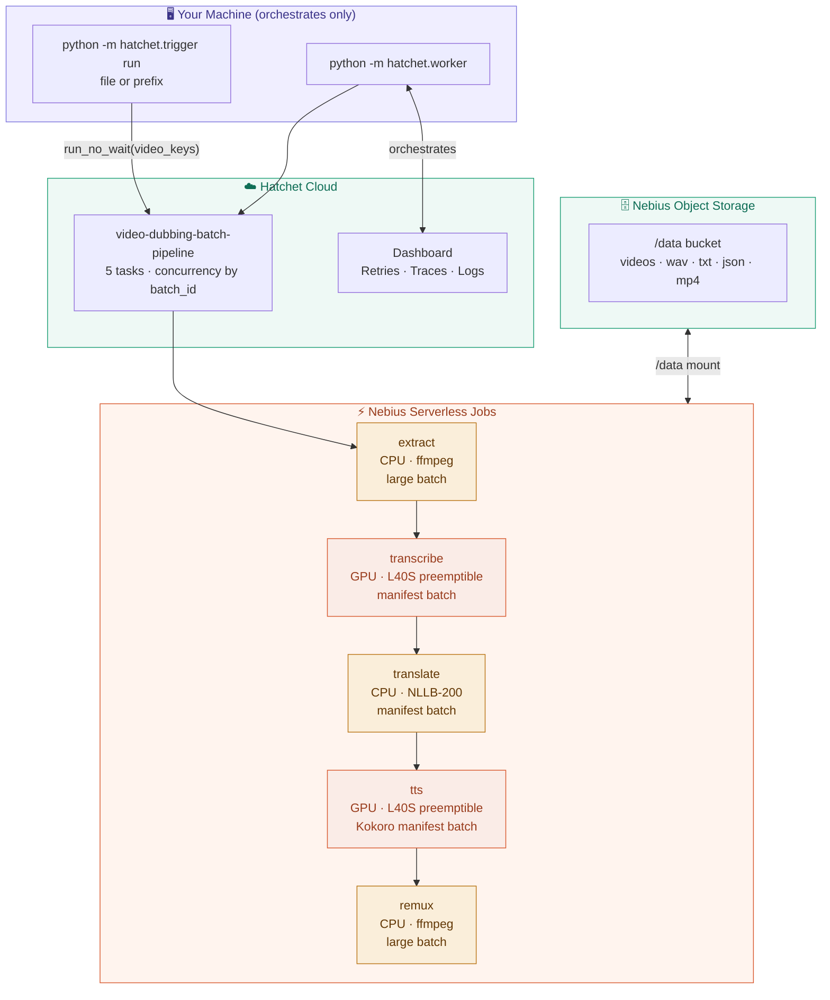
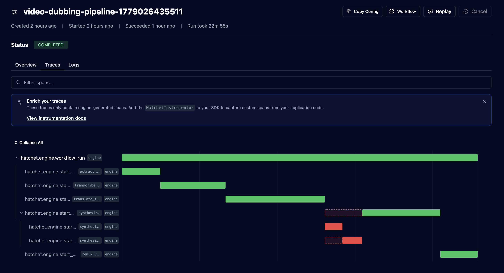
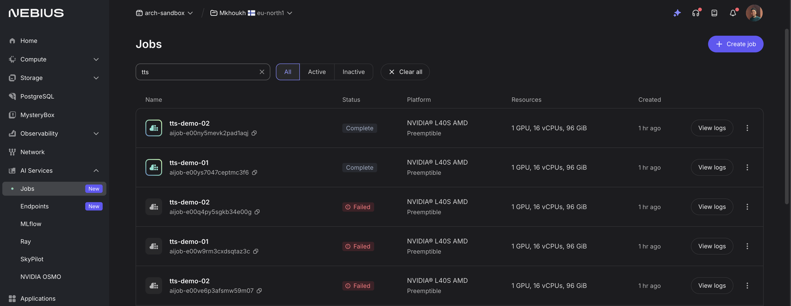

# Video Dubbing Pipeline with Hatchet and Nebius Serverless

This repository contains a video dubbing pipeline that turns an input video into
a translated, dubbed output video. It uses Hatchet to orchestrate the workflow
and Nebius Serverless Jobs to run the compute-heavy media and AI steps.

The goal is not to build a full video editing product. The goal is to show the
backend shape of a scalable dubbing system: one that can take a video from
object storage, process it through several specialized workloads, recover from
transient failures, and write the final dubbed video back to storage.

## What This Repo Does

The pipeline starts with one or many videos in Nebius Object Storage. One Hatchet
workflow run processes the whole batch:

```text
video_keys[] in object storage
  -> extract           (CPU ffmpeg, batched — many files per job)
  -> transcribe        (GPU preemptible, batched manifest — ASR + alignment)
  -> translate         (CPU NLLB-200, batched manifest)
  -> synthesize TTS    (GPU preemptible Kokoro, batched manifest)
  -> remux             (CPU ffmpeg, batched — many files per job)
  -> dubbed MP4s in object storage
```

Your local machine only runs the Hatchet worker. It never touches the video
data. Everything passes through object storage.

## Why Use Hatchet

Video dubbing is a workflow problem, not just a model invocation problem. A
single run involves multiple long-running steps, different container images,
GPU scheduling, cloud job polling, storage checks, and retries.

Hatchet is used here because it gives the pipeline:

- durable execution state for each dubbing run
- explicit task dependencies between stages
- automatic retries when a GPU job is preempted
- a clean visual timeline in the Traces view
- logs and visibility for every stage

The Hatchet worker does not perform the heavy computation itself. It submits
jobs to Nebius, waits for them to complete, validates that expected artifacts
exist in storage, and then moves the workflow to the next step.

## Why Use Nebius Serverless

Video dubbing combines workloads with very different compute needs. ffmpeg runs
well on CPU, while Whisper and TTS benefit from GPUs. Keeping all of that
capacity running all the time is wasteful.

Nebius Serverless Jobs let the pipeline run each stage on the right infrastructure:

- CPU jobs for ffmpeg extract/remux and NLLB-200 translation
- GPU jobs on preemptible L40S for transcribe and Kokoro TTS
- batched manifests so one job cold-start amortises over many files
- mounted object storage so every container sees the same `/data` workspace
- isolated, reproducible execution through Docker images

When a preemptible GPU is reclaimed, Nebius sets the job state to `ERROR`. The
pipeline detects this and raises a `RuntimeError`, which Hatchet catches and
retries automatically on a new GPU.

## Architecture




## Repository Layout

```text
.
|-- worker.py                    # Starts the Hatchet worker
|-- trigger.py                   # Triggers a single dubbing run
|-- batch_trigger.py             # Triggers multiple runs staggered over time
|-- pyproject.toml               # Python dependencies (core + optional [download])
|-- .env.example                 # Environment variable template
|-- pipeline/
|   |-- workflow.py              # Hatchet workflow and task definitions
|   |-- nebius.py                # Nebius job creation and polling helpers
|   |-- config.py                # Environment-based settings
|   `-- local.py                 # Object storage helpers
`-- containers/
    |-- whisper/                 # faster-whisper transcription image
    |-- translate/               # MADLAD-400 translation image
    `-- tts/                     # Coqui TTS synthesis image
```

## Requirements

- Python 3.11
- Docker
- [uv](https://github.com/astral-sh/uv) for Python environment management
- A [Hatchet Cloud](https://cloud.hatchet.run) account (free tier works)
- Nebius credentials with access to Serverless Jobs and Object Storage
- Container images pushed to a public registry (Docker Hub works)

## Important: Build Containers on AMD64

Nebius runs x86_64 (AMD64). If you build Docker images on Apple Silicon (M1/M2/M3),
the containers will fail to start with an architecture mismatch error.

Always build and push from a Linux AMD64 machine. A Nebius CPU VM works well:

```bash
# Create a CPU VM on Nebius
nebius compute instance create \
  --parent-id YOUR_PROJECT_ID \
  --name docker-builder \
  --preset 4vcpu-16gb \
  --platform cpu-e2 \
  --subnet-id YOUR_SUBNET_ID \
  --image-family ubuntu22.04 \
  --ssh-public-key "$(cat ~/.ssh/id_rsa.pub)"

# SSH in, install Docker, build and push
sudo apt-get install -y docker.io
docker build -t your-user/nebius-whisper:latest containers/whisper/
docker push your-user/nebius-whisper:latest
```

## Configuration

```bash
cp .env.example .env
```

Fill in the required values:

```text
HATCHET_CLIENT_TOKEN     # From Hatchet Cloud dashboard -> Settings -> API Keys
NEBIUS_IAM_TOKEN         # From: nebius iam get-access-token
NEBIUS_PROJECT_ID        # From: nebius iam project list
NEBIUS_SUBNET_ID         # From: nebius vpc subnet list
NEBIUS_BUCKET_ID         # From: nebius storage bucket list
NEBIUS_BUCKET_NAME       # Your bucket name
AWS_ACCESS_KEY_ID        # Nebius storage access key
AWS_SECRET_ACCESS_KEY    # Nebius storage secret key
AWS_ENDPOINT_URL         # https://storage.eu-north1.nebius.cloud
WHISPER_IMAGE            # your-dockerhub-user/nebius-whisper:latest
TRANSLATE_IMAGE          # your-dockerhub-user/nebius-translate:latest
TTS_IMAGE                # your-dockerhub-user/nebius-tts:latest
```

> **Note on IAM tokens**: `nebius iam get-access-token` generates a short-lived
> session token (expires in ~1 hour). For long-running workflows, create a
> service account and use its credentials instead.

## Install Dependencies

Use `uv` instead of standard `venv` — standard venv has known issues on newer
macOS versions:

```bash
brew install uv
uv venv .venv
source .venv/bin/activate
uv pip install -e .
```

## Run the Workflow

Upload a source video to your bucket:

```bash
aws s3 cp my-video.mp4 s3://your-bucket/my-video.mp4 \
  --endpoint-url https://storage.eu-north1.nebius.cloud
```

Start the worker:

```bash
python worker.py
```

Trigger a single dubbing run:

```bash
python trigger.py --video my-video.mp4 --lang de --run-id first-run
```

Trigger a batch of runs staggered 20 seconds apart:

```bash
python batch_trigger.py --video my-video.mp4 --count 5 --interval 20 --lang de
```

When the workflow completes, the final dubbed video is written to object storage:

```text
my-video_first-run_dubbed.mp4
```

Monitor runs in the Hatchet dashboard at https://cloud.hatchet.run. The
**Traces** tab shows a Gantt chart of all pipeline steps.

## Screenshots

After a run starts, Hatchet shows the workflow timeline in the **Traces** tab.
This screenshot shows a completed dubbing run after extraction, transcription,
translation, TTS, and remuxing all finished.



The Nebius Jobs view shows what happened underneath the Hatchet workflow. Some
TTS jobs were launched on preemptible GPU capacity and failed when that capacity
was interrupted. Hatchet treated those failures as retryable, launched new
preemptible jobs, and the later replacement jobs completed successfully.



## Known Limitations and Workarounds

**Object storage does not support seeking**: WAV and MP4 files cannot be written
directly to the `/data` FUSE mount because ffmpeg and scipy need to seek back to
write headers. The workaround used here is to write to `/tmp` first, then copy
the completed file to `/data`.

**Translation quality**: MADLAD-400 3B sometimes hallucinates on short texts or
unusual input. For production use, replace it with a stronger model or a
translation API.

**No time alignment**: The dubbed audio is synthesized from the full translated
text as a single pass. It will not match the timing of the original speech.
For production dubbing, forced alignment (e.g. WhisperX) is needePЗ
**Output quality**: The pipeline uses lightweight open-source models chosen for
simplicity and cost, not production quality. MADLAD-400 can produce poor
translations on short or unusual input, and Coqui TTS produces robotic-sounding
speech with no timing alignment to the original. This is intentional — the point
of this repo is to demonstrate the orchestration pattern and fault-tolerance on
preemptible GPUs, not to produce broadcast-quality dubbing.

For better results, swap in stronger models at each step:

- **Translation**: Replace MADLAD-400 with a larger LLM via the
  [Nebius Token Factory API](https://tokenfactory.nebius.com) (OpenAI-compatible)
  — Qwen3, DeepSeek V3, or Llama 3.3 70B all produce significantly better
  translations and run on Nebius infrastructure. Alternatively use DeepL or the
  OpenAI API.
- **TTS**: Replace Coqui with [ElevenLabs](https://elevenlabs.io) for voice
  cloning and natural-sounding speech, or
  [Kokoro](https://github.com/hexgrad/kokoro) as a high-quality open-source
  alternative.
- **Alignment**: Add [WhisperX](https://github.com/m-bain/whisperX) between
  transcription and TTS to force-align the dubbed audio to the original speech
  timing.

The architecture stays the same — each step is just a swappable Docker container.

**This is a reference pipeline**: No web UI, speaker diarization, lip sync, or
audio mixing. These are natural extensions on top of the orchestration pattern.
