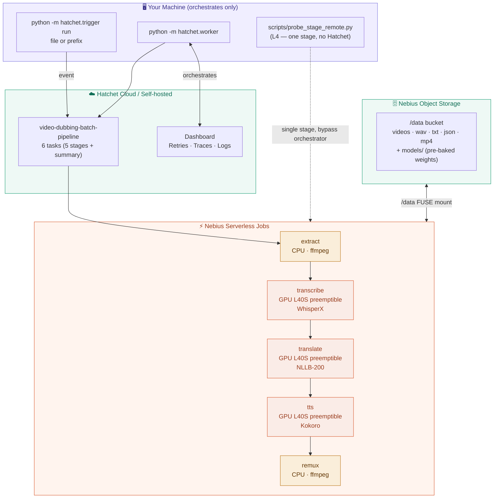

# Video Dubbing Pipeline with Hatchet and Nebius Serverless

A reference pipeline that turns videos into dubbed videos in another language,
orchestrated by Hatchet and executed on Nebius Serverless Jobs. The point isn't
to build a video-editing product — it's to show the **backend shape** of a
mixed CPU + GPU media pipeline that runs on preemptible compute, recovers from
failures, reports its own cost, and stays portable across orchestrators.

> First-time setup, hands-on commands, and troubleshooting live in
> **[DEVELOPER_GUIDE.md](DEVELOPER_GUIDE.md)**. This README is the front door:
> what the repo does, why these design choices, and where to look next.

## What This Repo Does

One Hatchet workflow run dubs one or many videos. Each stage runs as one (or
many — see fan-out below) Nebius serverless job:

```text
video_keys[] in object storage
  -> extract           (CPU ffmpeg                       — audio per video)
  -> transcribe        (GPU L40S preemptible · WhisperX  — ASR + word alignment)
  -> translate         (GPU L40S preemptible · NLLB-200  — text per language)
  -> tts               (GPU L40S preemptible · Kokoro    — synthesised speech)
  -> remux             (CPU ffmpeg                       — mux audio over video)
  -> summary           (cost rollup + savings vs on-demand)
  -> dubbed MP4s + run_summary.json in object storage
```

Your local machine only runs the Hatchet worker. It never touches video data.
Everything passes through Nebius Object Storage.

## Why this matters (in three plates)

### Hatchet — durable orchestration

Hatchet handles the orchestration plate: DAG dependencies, retries on Nebius
`ERROR` (preemption), task-level concurrency caps, traces and logs in the
dashboard. The worker submits Nebius jobs, waits, validates output artifacts,
moves on. It does no compute itself.

**It's also pluggable.** The pipeline's stage code under `src/jobs/*.py` and
`src/pipeline/*.py` doesn't import Hatchet. The Hatchet adapter lives in
`src/hatchet/`. Swap it for Prefect, Airflow, or a plain async Python driver —
the engine doesn't care. See `.dev/spec.md` Phase 5 for the planned layering.

### Nebius Serverless Jobs — pay-per-second mixed compute

ffmpeg wants CPU, Whisper / NLLB / Kokoro want GPU. Renting either 24/7 wastes
money. Nebius Serverless lets each stage pick its own machine and only pays for
the seconds it ran:

- CPU jobs for extract / remux on `cpu-e2`
- Preemptible L40S GPUs for transcribe / translate / tts (~80% cheaper than
  on-demand)
- Bucket FUSE-mounted at `/data` inside every container — same path on host
  and in cloud
- Docker images, so each stage is reproducible and swappable

When Nebius reclaims a preemptible GPU, the job ends in `ERROR`. The pipeline
raises `NebiusJobError`, Hatchet retries, and the next attempt picks up where
the previous one left off (per-file idempotency via S3 `object_exists` check).

### Cost story you can quote

Every run writes `runs/{run_id}/run_summary.json` with per-stage state
transitions (QUEUED → STARTING → RUNNING → terminal), preemptible cost, and
the on-demand cost the same wall-time would have produced. The savings number
is a real artifact, not a marketing claim.

## Architecture



### Fan-out (optional, configurable per stage)

Each stage can split its inputs into chunks of `batch_size` files and dispatch
them as `max_concurrent` parallel Nebius jobs. CPU stages default to one job
(extract/remux are I/O-bound, cold start dominates). GPU stages can fan out to
4–8 parallel jobs for batches of 100+ videos. Configured in
[`src/pipeline/config.py`](src/pipeline/config.py) under `HatchetConfig.stages`.

## Repository Layout

```text
.
├── src/
│   ├── pipeline/             ← orchestrator-agnostic engine layer
│   │   ├── __main__.py         CLI for L1/L2 (in-process Python runs)
│   │   ├── run.py              PipelineRun + run_stage / run_pipeline
│   │   ├── config.py           HatchetConfig (orchestrator) + nested PipelineConfig
│   │   ├── nebius.py           create_and_wait() — Nebius SDK wrapper
│   │   ├── metadata.py         manifests, reports, stems discovery, cost rollup
│   │   ├── storage.py          S3 + local fs I/O; staged_write for FUSE-safe writes
│   │   ├── paths.py            bucket-relative path helpers
│   │   ├── batch.py            chunking for fan-out
│   │   ├── cost.py             preset → $/min table for cost estimation
│   │   └── utils.py            Rich console + logging
│   ├── jobs/                 ← per-stage container entry points (uniform shape)
│   │   ├── extract.py          ffmpeg per video
│   │   ├── transcribe.py       faster-whisper + WhisperX
│   │   ├── translate.py        NLLB-200
│   │   ├── tts.py              Kokoro
│   │   └── remux.py            ffmpeg per video (audio + original video → MP4)
│   ├── hatchet/              ← Hatchet adapter (replaceable)
│   │   ├── workflow.py         6-task DAG
│   │   ├── worker.py           `python -m hatchet.worker`
│   │   └── trigger.py          `python -m hatchet.trigger run …`
│   └── models/               ← model cache helpers + sync logic
│       ├── model_cache.py      cache paths + local presence checks
│       ├── download.py         HF download helpers
│       ├── bucket.py           upload local cache → bucket
│       └── preflight.py        pre_flight_check(stage, location)
├── docker/                   ← per-stage Dockerfiles + self-hosted compose
├── scripts/
│   ├── docker_build.sh         build & push all 5 task images + base
│   ├── sync_models.py          one-shot: HF → local → bucket (idempotent)
│   ├── probe_stage_remote.py   L4 — one stage on Nebius, no orchestrator
│   └── download_samples.py     fetch demo videos
├── data/                     ← local in/out (git-ignored)
└── .env.example              ← credentials template (secrets only)
```

## Quick start

### Local (no Docker, no cloud) — under 5 minutes

```bash
uv sync && source .venv/bin/activate && uv pip install -e .
python -m pipeline run sample_file/sample.mp4 --run-id l2-demo --device cpu
```

Outputs land at `data/runs/l2-demo/remux/sample.mp4`. See
[DEVELOPER_GUIDE.md §4-5](DEVELOPER_GUIDE.md) for stage-by-stage debugging.

### Cloud probe (one Nebius job, no Hatchet) — verify everything before the full workflow

```bash
python scripts/probe_stage_remote.py extract --source sample_file/sample.mp4
```

Walks one stage through the full cloud round-trip (image pull, FUSE mount,
state-transition timeline, cost calculation) without paying the Hatchet setup
cost. See [DEVELOPER_GUIDE.md §8](DEVELOPER_GUIDE.md).

### Full Hatchet workflow

```bash
# Terminal 1
python -m hatchet.worker            # pre-flight: validates Nebius IAM + Hatchet token

# Terminal 2
python -m hatchet.trigger run sample_batch/ --run-id l5-batch
```

See [DEVELOPER_GUIDE.md §7-9](DEVELOPER_GUIDE.md) for the full cloud setup
(`.env`, image push, model pre-baking, sample upload).

## Configuration

Two config files:

- **[`.env`](.env.example)** — credentials only. Hatchet token, Nebius IAM,
  AWS keys. Not committed.
- **[`src/pipeline/config.py`](src/pipeline/config.py)** — everything else.
  Image tag, model choice, batch sizes, target language, per-stage compute
  presets, Hatchet retry counts. Edit the file for permanent changes; override
  via env vars for one-off runs (`PIPELINE__TRANSCRIBE__MODEL=large-v3 …`).

```text
.env  (one-time per workstation/server)
─────────────────────────────────────
HATCHET_CLIENT_TOKEN      Hatchet dashboard → Settings → API Keys
NEBIUS_IAM_TOKEN          nebius iam get-access-token  (~12 h TTL)
NEBIUS_PROJECT_ID         nebius iam project list
NEBIUS_SUBNET_ID          nebius vpc subnet list
NEBIUS_BUCKET_ID          nebius storage bucket list
NEBIUS_BUCKET_NAME        your bucket name
AWS_ACCESS_KEY_ID         Nebius storage access key
AWS_SECRET_ACCESS_KEY     Nebius storage secret key
AWS_ENDPOINT_URL          https://storage.eu-north1.nebius.cloud
```

> **IAM tokens expire** (~12 h default). When the worker fails with
> `UNAUTHENTICATED`, refresh the token and restart the worker. The worker's
> startup pre-flight check catches this before any task runs.

## Container images

All 5 task images are built once on amd64 (Nebius runs x86_64; Apple Silicon
hosts cross-build via Docker BuildKit). The included script handles base + all
5 task images:

```bash
scripts/docker_build.sh --push       # builds + pushes to mnrozhkov/video-dubbing-*
```

For first-time use on Apple Silicon, a Nebius CPU VM (`cpu-e2`) avoids slow
cross-build cache eviction; see [DEVELOPER_GUIDE.md §6 & §9](DEVELOPER_GUIDE.md).

## Screenshots

The Hatchet **Traces** tab shows a Gantt chart of each pipeline run. The
screenshot below shows a completed dubbing workflow — extract, transcribe,
translate, tts, remux all finished in sequence.


The Nebius Jobs view shows the cloud-side reality: some preemptible TTS jobs
were reclaimed mid-run (red), Hatchet retried them on fresh GPUs (green), and
the workflow completed successfully. Per-file idempotency means each retry
only re-processed files whose outputs weren't already in the bucket.


## Production caveats

This is a **reference pipeline**, optimised for clarity and the cost story —
not for broadcast-quality output. Real caveats:

- **Dub timing is full-pass**, not aligned to original speech. Audio is
  synthesised from the translated text in one go and remuxed over the source
  video. WhisperX alignment is captured during transcribe but currently used
  only for the transcript artifact, not for re-timing the dub.
- **No speaker diarization, no lip sync, no audio mixing** — single-speaker
  monolingual dubbing only.
- **Translation quality** depends on NLLB-200's training. Short or unusual
  input can produce mediocre output. For production, the natural swap is a
  larger LLM via the
  [Nebius Token Factory API](https://tokenfactory.nebius.com) (OpenAI-compatible).
- **Cost numbers in `run_summary.json` are estimates** from a hardcoded
  preset→$/min table in `src/pipeline/cost.py`. Verify against the actual
  Nebius pricing console before quoting publicly.

## Further reading

| File | What's there |
|---|---|
| [DEVELOPER_GUIDE.md](DEVELOPER_GUIDE.md) | Hands-on, level-by-level: L1 (one stage in Python) → L5 (full Hatchet workflow). Setup, troubleshooting, configuration reference. |
| [`pyproject.toml`](pyproject.toml) | Per-task dependency groups; `cuda-base` / `cpu-base` torch pinning. |
| [`.env.example`](.env.example) | Credentials-only template. |
